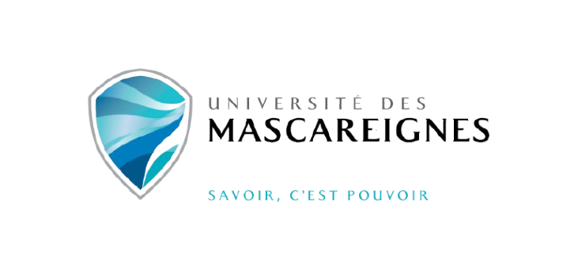
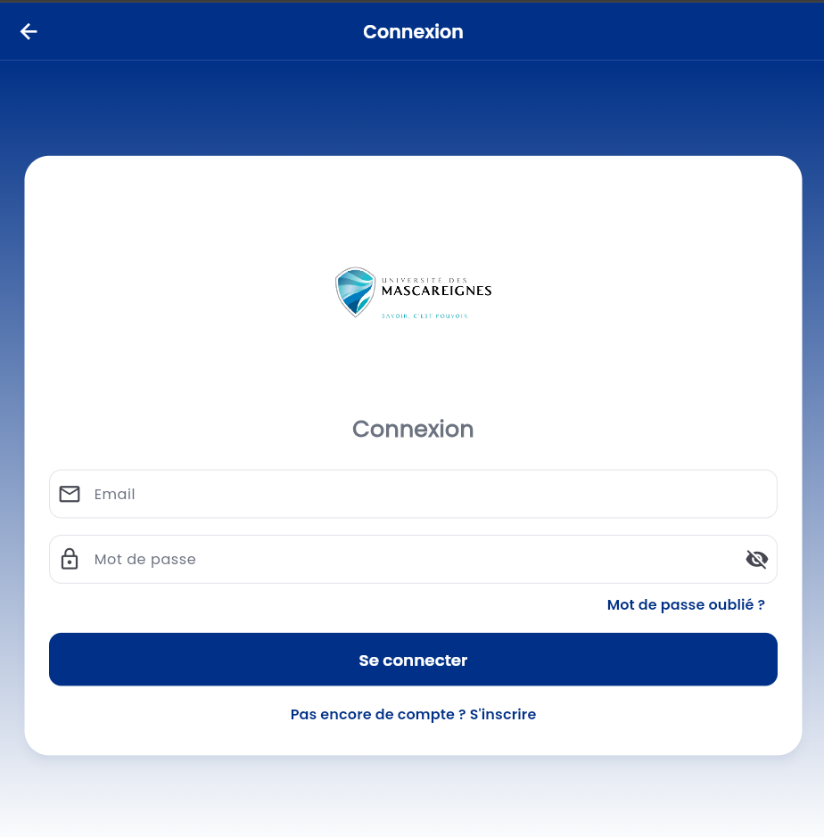
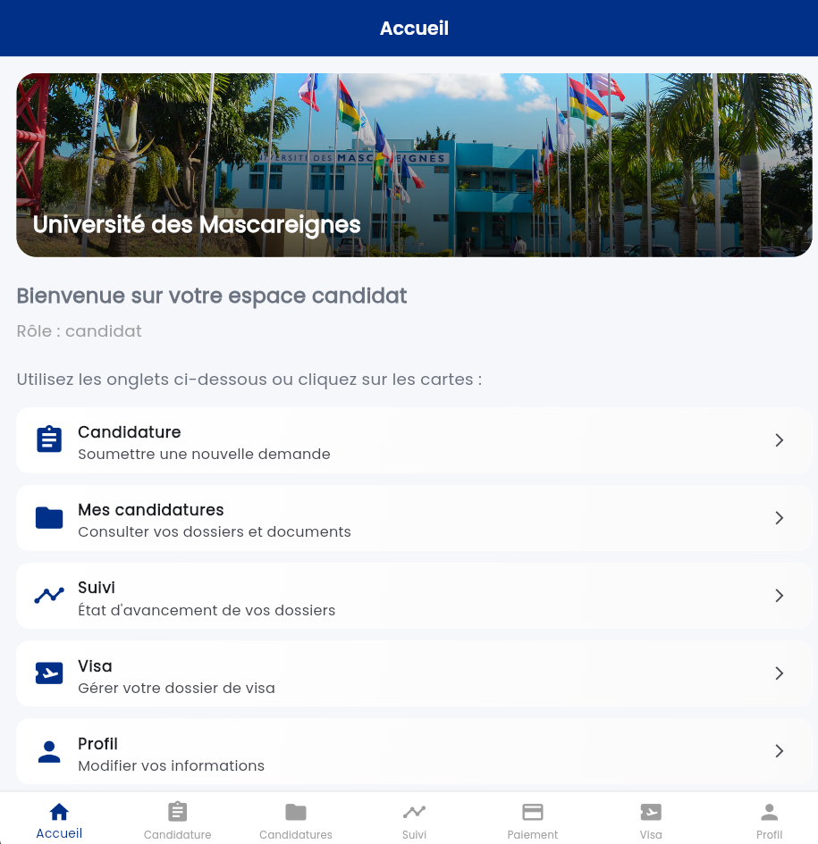
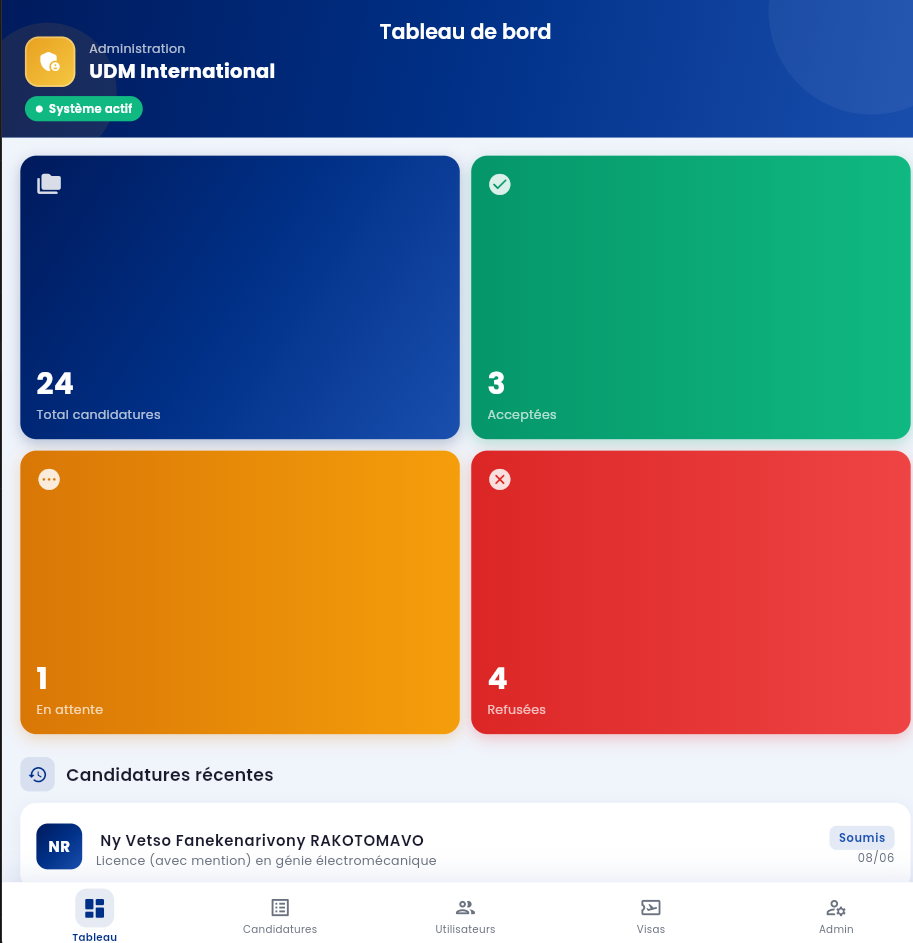
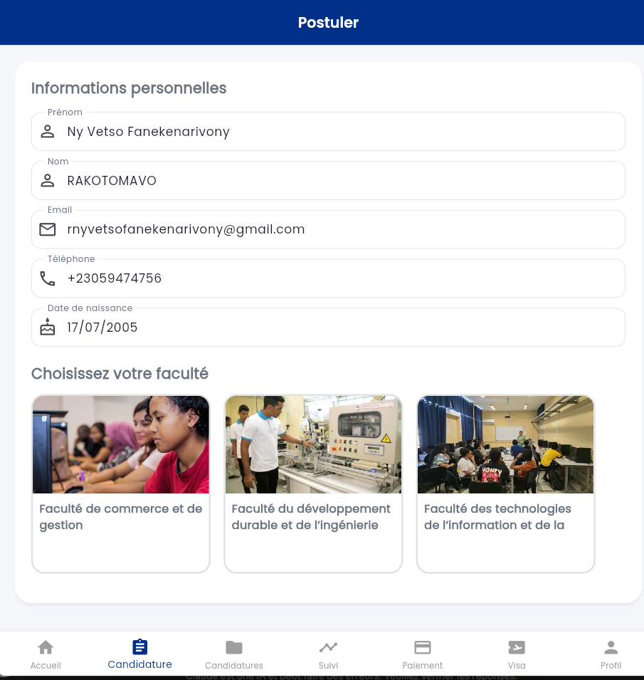
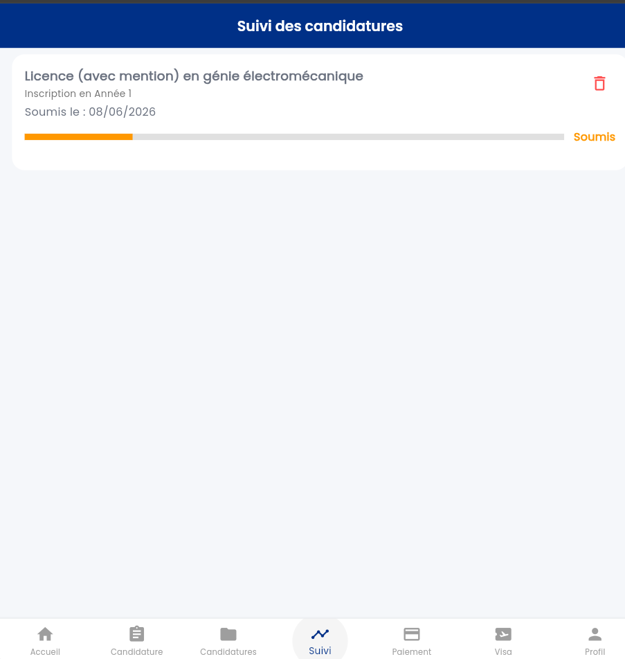
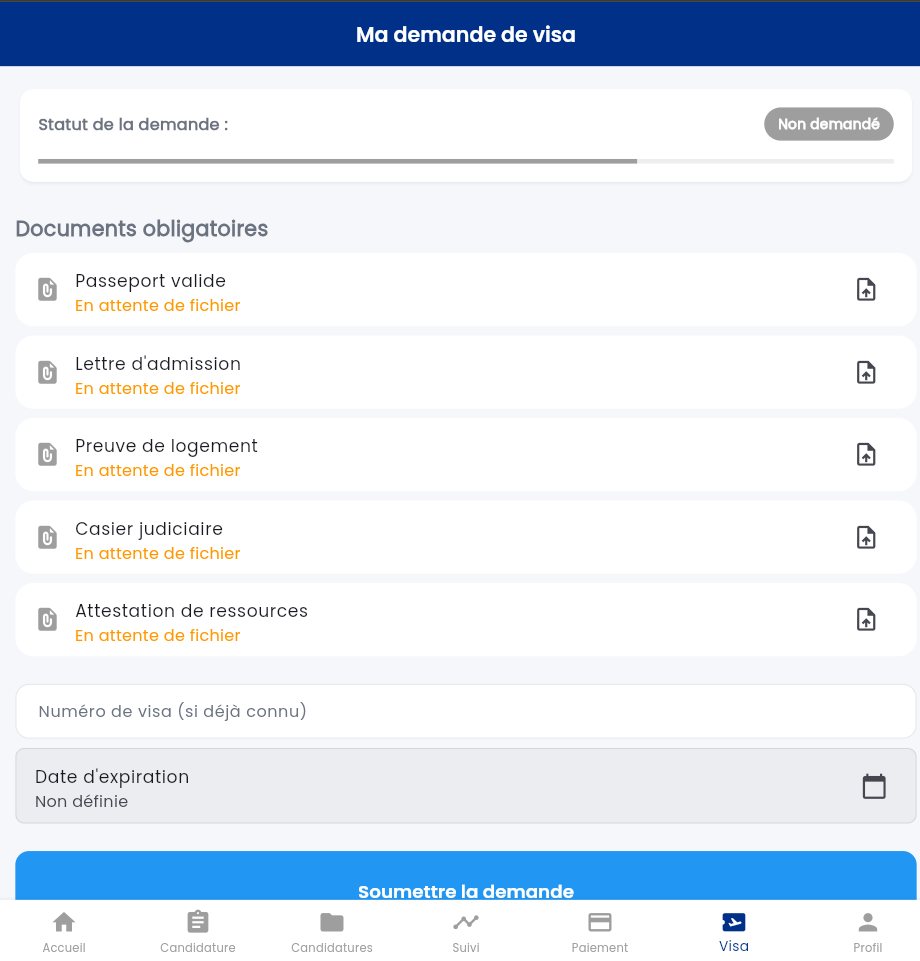

# 📱 UDM Mobile — Application de Gestion des Candidatures
### Université des Mascareignes · Projet de Fin d'Études

<p align="center">
  
</p>

<p align="center">
  
  
  
  
</p>

---

## 🎯 Description

**UDM Mobile** est une application mobile développée pour l'Université des Mascareignes permettant de **digitaliser et centraliser le processus de candidature universitaire**.

Elle résout plusieurs problèmes métier :

- 📄 **Dépôt de candidature en ligne** : les candidats soumettent leurs dossiers directement depuis leur téléphone, sans déplacement physique.
- 👤 **Gestion des rôles** : trois profils distincts — *Administrateur*, *Candidat* et *Étudiant* — avec des accès et fonctionnalités adaptés.
- 📊 **Suivi en temps réel** : les candidats suivent l'état d'avancement de leur dossier (en attente, accepté, refusé) depuis leur tableau de bord.
- 💳 **Paiement intégré** : gestion des frais d'inscription directement dans l'application.
- 🛂 **Gestion des visas** : suivi des démarches visa pour les étudiants étrangers.
- 🔔 **Communication simplifiée** : notifications et mises à jour en temps réel entre l'administration et les candidats.

---

## 📸 Captures d'écran

> *Remplacez les images ci-dessous par vos vraies captures d'écran.*

| Connexion | Tableau de bord Candidat | Espace Admin |
|-----------|--------------------------|--------------|
|  |  |  |

| Dépôt de candidature | Suivi de dossier | Gestion Visa |
|----------------------|------------------|--------------|
|  |  |  |

> 💡 **Astuce** : Pour créer un GIF de démonstration, utilisez [LiceCap](https://www.cockos.com/licecap/) (Windows/Mac) ou `adb screenrecord` sur Android, puis convertissez avec [ezgif.com](https://ezgif.com).

---

## 🛠️ Stack Technique

| Couche | Technologie |
|--------|-------------|
| **Framework mobile** | [Flutter](https://flutter.dev) 3.x (Dart) |
| **Authentification** | Firebase Authentication (email/password) |
| **Base de données** | Cloud Firestore (NoSQL temps réel) |
| **Stockage fichiers** | Firebase Storage + Cloudinary |
| **Backend serverless** | Firebase Cloud Functions (Node.js) |
| **Gestion d'état** | Provider |
| **UI** | Material Design 3, Google Fonts, flutter_svg |
| **PDF** | Syncfusion Flutter PDF Viewer |
| **Internationalisation** | flutter_localizations (FR / EN) |
| **Gestion fichiers** | image_picker, file_picker |

---

## 🏗️ Architecture du projet

```
lib/
├── core/
│   └── theme/          # Thème global de l'application
├── models/             # Modèles de données (Role, ...)
├── screens/
│   ├── admin/          # Interface administrateur
│   ├── auth/           # Connexion, inscription, vérification email
│   ├── candidate/      # Espace candidat (candidature, paiement, visa)
│   └── student/        # Espace étudiant
└── services/           # Logique métier (auth, Firestore, paiement...)
```

---

## 🚀 Installation & Lancement

### Prérequis
- [Flutter SDK](https://flutter.dev/docs/get-started/install) ≥ 3.3.0
- Android Studio ou VS Code
- Compte Firebase avec un projet configuré

### Étapes

```bash
# 1. Cloner le dépôt
git clone https://github.com/vetsojkr/UDM_Mobile.git
cd udm-application

# 2. Installer les dépendances
flutter pub get

# 3. Configurer Firebase
# Ajoutez vos fichiers firebase_options.dart et google-services.json
# (non inclus dans ce dépôt pour des raisons de sécurité)

# 4. Lancer l'application
flutter run
```

> ⚠️ Les fichiers de configuration Firebase (`firebase_options.dart`, `google-services.json`) ne sont pas inclus dans ce dépôt. Contactez le mainteneur ou configurez votre propre projet Firebase.

---

## 👥 Rôles utilisateurs

| Rôle | Accès |
|------|-------|
| **Candidat** | Soumettre une candidature, suivre son dossier, payer les frais, gérer son visa |
| **Étudiant** | Accès après admission, gestion visa, paiements |
| **Administrateur** | Gérer toutes les candidatures, valider les dossiers, gérer les profils |

---

## 👨‍💻 Auteur

RAKOTOMAVO Ny Vetso
Étudiant en informatique applique — Université des Mascareignes
- GitHub : [@vetsojkr](https://github.com/vetsojkr)
- LinkedIn : Ny Vetso Fanekena

---

## 📄 Licence

Ce projet a été réalisé dans le cadre d'un Projet de Fin d'Études (PFE) à l'Université des Mascareignes.
